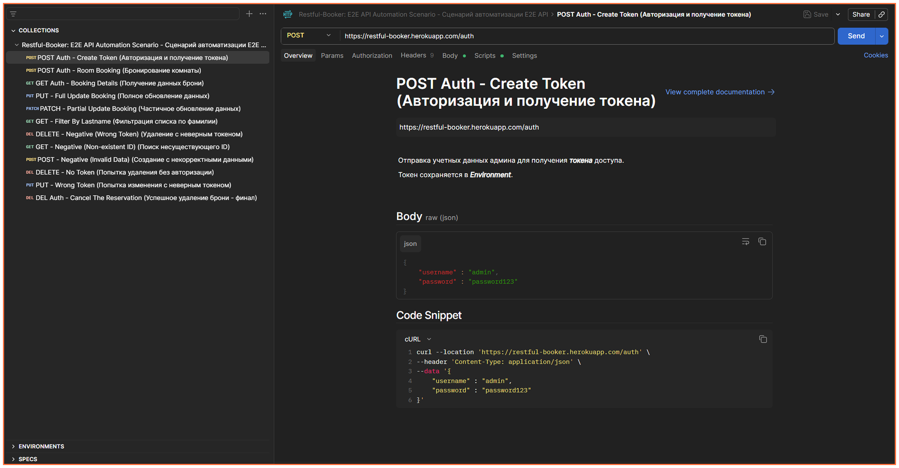
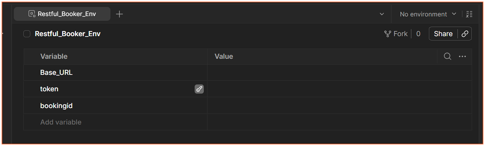
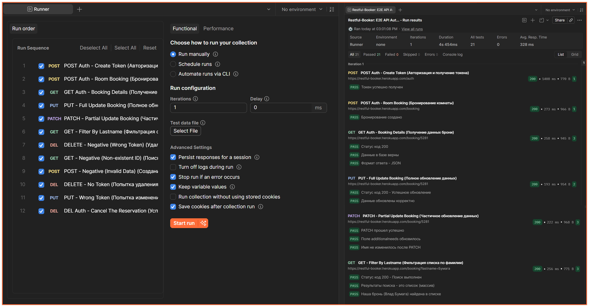

# 📋 API Тестирование: Restful-Booker -<br> Комплексная автоматизация E2E сценариев

**Примечание:**<br> 
> На реальном проекте мы не использовали тестирование API через Postman.<br>
Данные тесты выполнены в рамках демонстрационного примера работ<br>
с целью показать навык и умение работать в Postman и тестировать API.
&nbsp; &nbsp;
## **🧪 Обзор проекта**

**Проект:**<br>
> Автоматизация комплексного E2E сценария бронирования для учебного API `Restful-Booker`.

**Инструмент:**<br>
> Postman (Collection Runner + Newman CLI).

**Цель:**<br>
> Проверка полного жизненного цикла сущности "Бронирование" с валидацией позитивных и негативных кейсов,<br>включая авторизацию, контроль доступа и обработку граничных условий.

## 💡 Что я тестировал

Сервис позволяющий управлять бронированием номеров в отеле.<br>

✅ Я проверил все основные действия, которые может делать пользователь:

1. **Авторизоваться** (получить доступ)
2. **Создать бронь**
3. **Посмотреть данные брони**
4. **Полностью изменить бронь**
5. **Частично обновить бронь** (например, только имя гостя)
6. **Найти бронь по фамилии гостя**
7. **Удалить бронь**

🔒 Также отдельно проверил **защиту** - негативные проверки:<br>

1. **Удаление с неверным токеном**<br>
2. **Поиск несуществующего ID**<br>
3. **Создание с некорректными данными**<br>
4. **Попытка удаления без авторизации**<br>
5. **Попытка изменения с неверным токеном**<br>

---

## 💡 Как выглядит коллекция запросов

Вот так выглядит моя коллекция в Postman - это список всех запросов, которые выполняются по порядку:



> **Скриншот 1** - Структура коллекции: видно все 12 запросов и окружение `Restful_Booker_Env`

---

## 💡 Окружение и переменные

Я создал специальное окружение, где храню все важные данные:

- **Ссылка на сервер** `Base_URL` - чтобы не писать её в каждом запросе
- **Токен авторизации** `token` - автоматически сохраняется после входа
- **ID брони** `bookingid` - сохраняется после создания и используется во всех следующих запросах

Вот как выглядит настройка окружения:



> **Скриншот 2** - Переменные окружения: `Base_URL`, `token`, `bookingid`

---

## 💡 Запуск всех тестов одной кнопкой (Collection Runner)

Запускать каждый запрос вручную - долго.<br>Поэтому я объединил их в единый цикл автотестов.<br>Это нужно для того, чтобы за 5 секунд проверить всю логику приложения: от создания брони до её удаления.

**Зачем это делается:**

*   **Проверка цепочки действий:**<br>Мы убеждаемся, что данные правильно передаются между запросами<br>(например, созданное бронирование реально можно найти и изменить).

*   **Имитация реального пользователя:**<br>Тесты проходят путь клиента от начала до конца, проверяя,<br>не «сломалось» ли что-то в середине процесса.

*   **Быстрый поиск ошибок:**<br>Если после правок в коде разработчика что-то пойдет не так,<br>мы мгновенно увидим «красную» ошибку в отчете.

*   **Проверка на "дурака":**<br>Специальные негативные тесты проверяют,<br>что система не пустит пользователя без пароля или с неверными данными.

&nbsp; &nbsp;



> **Скриншот 3** - Итоги прогона: 12 запросов, 21 проверка, все пройдены, 0 ошибок

## 📊 Результаты выполнения (Postman Collection Runner)
Прогон выполнен через встроенный **Runner** Postman. Статус: **✅ Все тесты пройдены успешно**.

| Метрика | Значение | Статус |
| :--- | :--- | :---: |
| **Всего итераций** | 1 | - |
| **Всего запросов в коллекции** | 12 | ✅ 0 ошибок |
| **Всего ассертов (проверок)** | 21 | ✅ 21 / 21 пройдено |
| **Провалено тестов** | 0 | 🏆 100% успех |
| **Пропущено тестов** | 0 | - |
| **Среднее время ответа** | 276 ms | ⚡ Стабильно |
| **Общая длительность прогона** | 3s 949ms | 🚀 Оптимально |

---

## 📋 Пример кода из тестов:

```javascript
// Сохраняем ID брони для следующих шагов
const response = pm.response.json();
pm.environment.set("bookingId", response.bookingid);

// Проверяем что код ответа 200
pm.test("Статус код 200", function () {
    pm.response.to.have.status(200);
});

// Проверяем что данные совпадают
pm.test("Данные в базе верны", function () {
    pm.expect(response.firstname).to.eql("Влад");
});

```

---

## 📊 Итоги

*   Мой проект по автоматизации E2E сценариев в Postman демонстрирует полный жизненный цикл бронирования,<br>включая авторизацию и валидацию API-запросов.<br>
*   Реализованная структура обеспечивает гибкость за счет параметризации, чистоту данных через удаление сущностей<br>и готовность к CI/CD интеграции через Newman, подтверждая навыки проектирования стабильных тестов.

---

### 📊 Мои проекты

### 🛠 Проекты и опыт (QA Engineering)

| Проект | Описание | Стек технологий | Ссылка |
| :---: | :---: | :---: | :---: |
| **Тестовая документация** | Создание тест-кейсов и чек-листов для ПАК «Кордон» | Jira, TestRail, MS Excel | [](./TEST_DOCS_KORDON.md) |
| **SQL запросы** | Валидация данных и сложные выборки для проверки БД | MySQL, DBeaver | [](./TEST_DOCS_KORDON.md) |
| **Автоматизация** | Разработка автотестов для регрессионного тестирования | Python + Selenium | [](./AUTOTESTS.md) |
| **Mind-map** | Визуализация стратегии покрытия<br>Декомпозиция проекта | XMind | [](./MAP/KORDON_MINDMAP_CASE.md) |
| **План / Test Plan** | Стратегия обеспечения качества<br> Методология проверок | Markdown, Confluence | [](./TEST_PLAN_KORDON.md) |
| **Test Summary Report** | Отчет по итогам цикла тестирования с метриками | Allure, MS Word | [](./TEST_SUMMARY.md) |

**💡 Следующий кейс:**

&nbsp;&nbsp;&nbsp;&nbsp;&nbsp;[](./TEST_DOCS_KORDON.md)

---

[](https://github.com/Leonid-QA)
