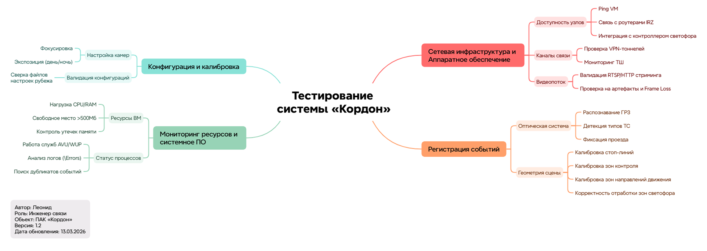

# Кейс: Проектирование стратегии тестирования ПАК «Кордон»

Для систематизации процесса тестирования и обеспечения полного покрытия функционала ПАК «Кордон» была проведена декомпозиция системы. 

Использование Mind Map позволило визуализировать архитектуру проекта и выявить критические точки интеграции аппаратной и программной частей.

---

## 🗺 Интеллект-карта проекта

Интеллект-карта структурирована по четырем ключевым доменам: инфраструктура (L1-L3), бизнес-логика регистрации событий, системный мониторинг и конфигурация рубежа.

Рисунок 1: Стратегия тестирования системы "Кордон"

---

## 🛠 Методология и практическая ценность

Использование данной карты в процессе тестирования решило следующие задачи:

1.  **Системный анализ зависимостей:** Визуализация связей между аппаратным обеспечением (ТШ, роутеры IRZ) и работой сервисов (AVU/WUP). Это позволяет локализовать ошибки на ранних этапах (например, отсекать ложные баги софта при проблемах со связностью).
2.  **Проектирование тестовой документации:** Каждый узел карты послужил основой для создания структурированного чек-листа. Это обеспечило 100% покрытие проверок: от стабильности RTSP-потоков до специфических багов логирования (дублирование событий).
3.  **Оптимизация мониторинга:** Карта позволила внедрить регламент проверки системных ресурсов (Disk C/D, утечки RAM), что критически важно для отказоустойчивости комплексов фотовидеофиксации.

## 🔗 Реализация в чек-листе
На базе представленной карты был разработан детальный [Чек-лист тестирования ПАК Кордон](ссылка_на_файл), включающий в себя приемочные проверки и регрессионную модель тестирования.

---

### Технологический стек кейса:
*   **Networking:** ICMP, VPN-туннелирование, протоколы RTSP/HTTP, мониторинг каналов связи (L3).
*   **System:** Анализ системных логов (`\Errors`), контроль ресурсов ОС, управление службами Windows/Linux.
*   **QA:** Декомпозиция системы, составление тестовой документации, функциональное и интеграционное тестирование.

  ---

---

# Кейс: Проектирование стратегии тестирования ПАК «Кордон»

Для систематизации процесса тестирования и обеспечения полного покрытия функционала программно-аппаратного комплекса «Кордон» была проведена детальная декомпозиция системы. 

Использование методологии Mind Map позволило визуализировать многоуровневую архитектуру проекта, выделить критические точки интеграции аппаратной части, системного ПО и прикладных сервисов, а также формализовать зоны ответственности при проведении приемо-сдаточных испытаний.

---

## 🗺 Интеллект-карта проекта

Интеллект-карта структурирована по четырем ключевым доменам: инфраструктура и аппаратное обеспечение, системный мониторинг и настройка ОС, конфигурация рубежа и бизнес-логика регистрации событий.

*Рисунок 1: Стратегия тестирования системы «Кордон»*

---

## 🛠 Методология и практическая ценность

Применение данной карты в процессах обеспечения качества и эксплуатации позволило решить следующие прикладные задачи:

1.  **Системный анализ зависимостей:** Визуализированы связи между состоянием аппаратного обеспечения (серверы, камеры, каналы связи) и работоспособностью критических служб (`AUV`, `WUP`). Это позволяет на этапе диагностики однозначно отсекать ложные дефекты программного обеспечения при наличии проблем на уровне инфраструктуры (падение VPN-туннеля или деградация ICMP).
2.  **Проектирование тестовой документации:** Каждый узел карты трансформирован в атомарный пункт чек-листа, что гарантирует 100% покрытие функциональных и нефункциональных требований: от стабильности транспортных протоколов (`RTSP`, `PSH`, `TTP`) до выявления специфических аномалий обработки данных (дублирование событий в логах).
3.  **Оптимизация мониторинга и отказоустойчивости:** Карта обосновывает внедрение строгого регламента контроля системных ресурсов (свободное место на дисках >500 МБ, утилизация CPU/RAM, управление службами Windows), что является критическим фактором непрерывной работы комплексов фотовидеофиксации.

## 🔗 Реализация в чек-листе
На базе представленной декомпозиции разработан детальный [Чек-лист тестирования ПАК Кордон](ссылка_на_файл), включающий в себя блоки приемочного, интеграционного и регрессионного тестирования.

---

### Технологический стек кейса:
*   **Networking:** ICMP, VPN-туннелирование, протоколы RTSP/PSH/TTP/HTTP, мониторинг каналов связи (L3).
*   **System:** Анализ системных логов (`\Errors`), контроль ресурсов ОС, управление службами Windows, контроль целостности конфигурационных файлов.
*   **QA:** Декомпозиция системы, составление тестовой документации, функциональное и интеграционное тестирование, анализ дублирования событий.

---

