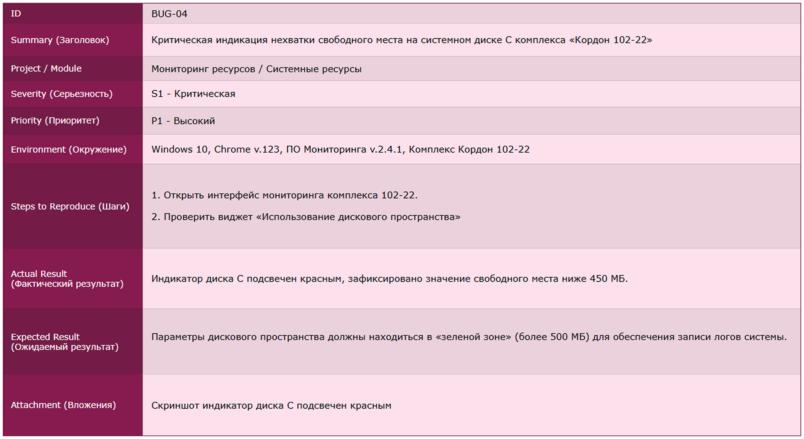

# 🧪 Case Study: Тестирование обновления ПАК «Кордон»

> **Этот кейс** - выжимка из моего реального опыта работы инженером связи. 
> Я показываю подход к тестированию промышленных систем (UAT/регресс) на примере комплексов фотовидеофиксации. 
Основная цель раздела - продемонстрировать навыки создания **чек-листов**, **тест-кейсов** и **баг-репортов**.

---

### 📄 Обзор задачи и контекст

*   **Система:**   Программно-аппаратный комплекс «Кордон». 
*   **Задача:**   Провести приемочное тестирование обновления ПО 
версии 3.6 на группе из 4 тестовых комплексов перед массовым деплоем. 
*   **Моя роль:**   Инженер, ответственный за валидацию функциональной стабильности и сетевого взаимодействия.

&nbsp;&nbsp;*Почему это было важно?* 
&nbsp;&nbsp;&nbsp;&nbsp;Ошибка на одном комплексе могла привести к юридически невалидным штрафам.  
&nbsp;&nbsp;&nbsp;&nbsp;Я отвечал за весь цикл тестовой документации и сквозную валидацию цепочки «Камера → Сеть → Сервер → База Данных»

---

### 🧠 Этап 0: Анализ и стратегия покрытия

&nbsp;&nbsp;Любое тестирование начинается с вопроса *«А что мы вообще проверяем?»*.  
&nbsp;&nbsp;Чтобы не упустить узкие места на стыке железа и софта, я отрисовал Mind Map.

- **Инструмент:** XMind.
- **Фокус внимания:**

    - **Hardware:** Доступность ВМ, телекоммуникационных шкафов (ТШ), контроллеров.
    - **Software:** Процессы регистрации ТС, ротация логов, потребление RAM.
    - **Network:** Стабильность RTSP-потоков и Heartbeat-сигналов.

> *Ссылка на карту:* 
>
> 

---

### ✅ Этап 1: Проектирование тестов (Test Design)
&nbsp;&nbsp;&nbsp;&nbsp;&nbsp;&nbsp;Имея на руках карту, я перешел к написанию документации. 
&nbsp;&nbsp;&nbsp;&nbsp;&nbsp;&nbsp;Так как работа велась в инженерной среде, первичная документация оформлялась в Excel.

###  &nbsp;&nbsp;📋 Чек-лист приемки стенда

> &nbsp;&nbsp;Это фрагмент чек-листа, который я использовал для контроля готовности стенда. 
> &nbsp;&nbsp;В нем отражены ключевые проверки доступности оборудования и базовой функциональности.
&nbsp;&nbsp;  &nbsp;&nbsp;

### 📊 Анализ результатов обновления:

&nbsp; &nbsp;

**Выявленные баги ❌ и критические баги ⚠️:** 

&nbsp;❌ **REG-06:** Сбой регистрации ТС в БД на комплексе 101-11. 

&nbsp;&nbsp;&nbsp;⚠️ **REG-07:** Нестабильность трансляции видеопотока (Frame Loss > 15%) на комплексе 103-33. 

&nbsp;❌ **REG-09:** Баг «Размножение дублей» записей WUP в системе на комплексе 101-11. 

&nbsp;&nbsp;&nbsp;⚠️ **REG-12:** Критическое заполнение раздела Disk C (логи ошибок заняли > 40Гб) на комплексе 103-33. 

**Итог:** &nbsp;Обновление было отправлено на доработку. &nbsp;&nbsp;&nbsp;&nbsp;&nbsp;&nbsp;&nbsp;&nbsp;&nbsp;&nbsp;&nbsp;Разработчикам предоставлен детальный отчёт о дефектах с приложением системных логов из директории `D:\Errors`.

---

### ✅ Этап 2: Проектирование тест-кейсов (Test Design)

&nbsp;&nbsp;&nbsp;&nbsp;&nbsp;&nbsp;На основе чек-листа я разработал атомарные кейсы с четкими предусловиями. 
&nbsp;&nbsp;&nbsp;&nbsp;&nbsp;&nbsp;Это позволяет воспроизвести тест любому члену команды без лишних вопросов. 

### 📋 Ключевые сценарии:
- **TC-MON-01:** Синхронизация события с видеопотоком (задержка не более 5 сек).
- **TC-MON-02:** Имитация обрыва связи и проверка генерации алерта `Connection Lost`.
- **TC-MON-03:** Алгоритм циклической перезаписи при заполнении диска до 90%.
&nbsp;  &nbsp;

#### 📋 Структура моих тест-кейсов:
Я придерживаюсь классического стандарта оформления, что критично при работе в команде:

*   **Предусловия:** Четкое описание состояния «железа» перед тестом.
*   **Тестовые данные:** Конкретные IP-адреса, логины и пути к архивам.
*   **Ожидаемый результат:** Однозначный критерий успеха (например, "Тайм-аут < 30 сек").

---

### ✅ Этап 3: Работа с багами 🐞 (Bug Reporting)

&nbsp;&nbsp;&nbsp;&nbsp;Помимо собственного чек-листа, я прошёл тестирование по чек-листу смежной команды. 
&nbsp;&nbsp;&nbsp;&nbsp;Это помогло расширить покрытие в рамках перекрёстного тестирования для исключения эффекта пестицида. 

&nbsp;&nbsp;&nbsp;&nbsp;Тестирование выявило ряд критических несоответствий. 
&nbsp;&nbsp;&nbsp;&nbsp;Я оформил баг-репорты так, чтобы разработчику не пришлось переспрашивать детали. 

> &nbsp;&nbsp;&nbsp;&nbsp;Ниже - примеры самых значимых дефектов. 

#### 🚨 BUG-01: Отсутствие фиксации проездов ТС в базе данных на комплексе «Кордон 101-11»

&nbsp;&nbsp;**Суть бага:**  
*   &nbsp;&nbsp;Данные о проезде транспортных средств не сохраняются в базу данных комплекса.  
*   &nbsp;&nbsp;В журнале регистрации событий отсутствует запись о новом проезде, данные не отображаются в интерфейсе мониторинга, что делает невозможным фиксацию нарушений.

---

#### ⚠️ BUG-02: Множественное дублирование записей WUP (Баг «Размножение дупла»)

&nbsp;&nbsp;**Суть бага:**  
*   &nbsp;&nbsp;В модуле анализа комплекса «Кордон 104-44» наблюдается появление идентичных записей WUP для одного и того же системного события.  
*   &nbsp;&nbsp;Вместо одной уникальной записи система генерирует копии, что засоряет журнал регистрации и замедляет работу ПО.

---

#### 🔒 BUG-03: Потеря видеосигнала (No Signal) и зависание кадра с комплекса «Кордон 103-33»

&nbsp;&nbsp;**Суть бага:** 
*   &nbsp;&nbsp;При трансляции видеопотока с основной камеры происходит обрыв связи, в результате чего в окне мониторинга отображается статичный кадр или сообщение «Ошибка потока».  
*   &nbsp;&nbsp;Данный дефект делает невозможным визуальный контроль рубежа в реальном времени и требует перезагрузки интерфейса или модуля видеотрансляции.

---

#### ❌ BUG-04: Критическая индикация нехватки свободного места на системном диске С комплекса «Кордон 102-22»

*   &nbsp;&nbsp;Индикатор диска С переходит в «красную зону» при достижении порога свободного места ниже 450 МБ.  
*   &nbsp;&nbsp;Критический дефицит памяти препятствует штатной записи системных логов, что может привести к нестабильной работе ПО комплекса и потере данных.

---

### 📈 Итоги и выводы

В результате проведения структурированного тестирования:

- 🗺️ **Mind Map** - декомпозиция системы и визуализация зон риска. Стала основой для чек-листа. 
- ✅ **Чек-лист** из 20 пунктов - позволил отсечь нестабильную сборку на раннем этапе. 
- 📋 **3 Тест-кейса** - атомарные сценарии с предусловиями и ожидаемыми результатами. 
- 🚨 **4 Баг-репорта** - оформлены без необходимости уточнений. 

**Результат:**
- 🚫 **Предотвращена** установка нестабильной прошивки на 47 комплексов.
- 🔴 **Выявлено 2 критических дефекта**, влияющих на юридическую значимость штрафов.

---

&nbsp;&nbsp;
> *Понимание физики процессов и оценка рисков для заказчика помогли проверить обновление, 
> найти критические баги и не допустить нестабильную прошивку в эксплуатацию.*

---

### 📊 Мои проекты

### 🛠 Проекты и опыт (QA Engineering)

| Проект | Описание | Стек технологий | Ссылка |
| :---: | :---: | :---: | :---: |
| **API тестирование** | Автоматизированные коллекции тестов для REST-сервисов | Postman, Swagger |  |
| **SQL запросы** | Валидация данных и сложные выборки для проверки БД | MySQL, DBeaver |  |
| **Автоматизация** | Разработка автотестов для регрессионного тестирования | Python + Selenium |  |
| **Mind-map** | Визуализация стратегии покрытия Декомпозиция проекта | XMind |  |
| **План / Test Plan** | Стратегия обеспечения качества  Методология проверок | Markdown, Confluence |  |
| **Test Summary Report** | Отчет по итогам цикла тестирования с метриками | Allure, MS Word |  |

**💡 Следующий кейс:** 

&nbsp;&nbsp;&nbsp;&nbsp;&nbsp;

---

