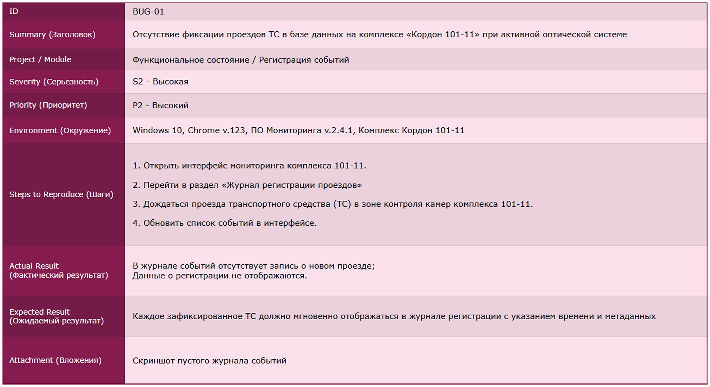
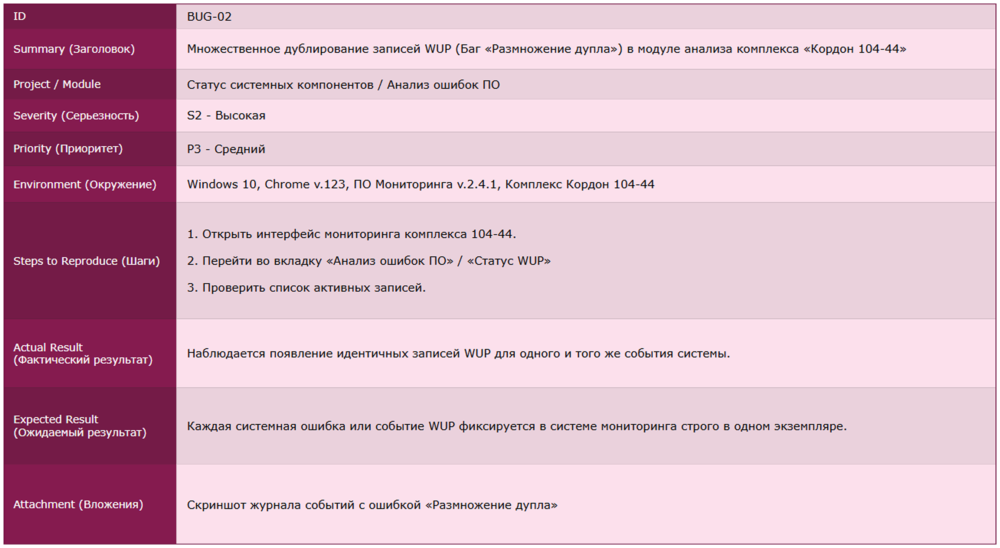
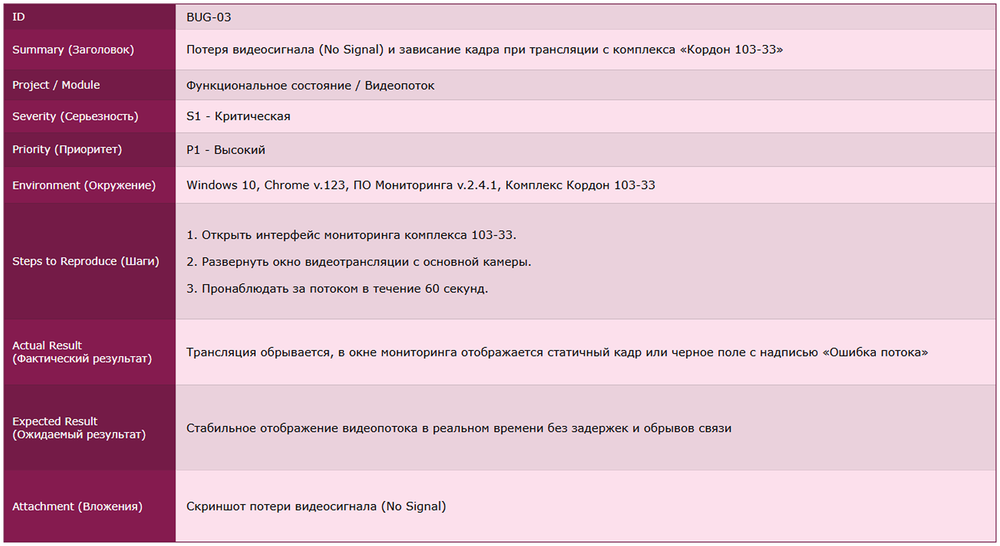

# Case Study: Тестирование обновления ПАК «Кордон»

### 📄 Обзор задачи
**Контекст:** На объектах мониторинга (комплексы «Кордон») планировалось обновление системного ПО до версии 3.6.  
**Моя роль:** Инженер связи.  
**Задача:** Провести приемочное тестирование (UAT) и регрессионное тестирование обновленной версии ПО на группе из 4-х тестовых комплексов перед массовым раскатыванием прошивки.

---

### 🧠 Этап 1: Аналитика и декомпозиция (Mind-Map)
Прежде чем приступить к тестам, я провел декомпозицию системы для визуализации стратегии покрытия. 
*   **Инструмент:** XMind.
*   **Что учтено:** Я разделил проверки на функциональное состояние комплекса (Hardware + Сеть) и стабильность системных компонентов (анализ ошибок ПО, ресурсы системы).
*   *Результат:* Это позволило не упустить проверки на стыке «софт-железо», такие как калибровка зон и работа видеопотока RTSP.
[⬅ Посмотреть карту](./MAP/KORDON_MINDMAP_CASE.md)

---

### 🛠 Этап 2: Проектирование тестов (Test Design)
Для реализации проверок я подготовил расширенный чек-лист. Изначально документация велась в **MS Excel** (см. скриншот ниже), но для масштабирования процесса я перенес кейсы в специализированную TMS-систему **Qase.io**.

#### Ключевые проверки из моего чек-листа:
1.  **Доступность VM и сетевых узлов:** Пинг и проверка связи с роутерами RZ и контроллерами светофоров.
2.  **Регистрация событий:** Валидация записи ТС в базу данных после проезда (проверка сквозного прохождения данных).
3.  **Мониторинг ресурсов:** Контроль утечек памяти (RAM) и свободного места на дисках после апдейта.
4.  **Валидация конфигурации:** Проверка того, что обновление не «сбросило» настройки фокуса камер, стоп-линий и зон детекции.

---

### 📊 Этап 3: Выполнение тестов и отчетность
На скриншоте представлен результат одного из циклов тестирования (Regression Run):

**Анализ результатов:**
**Выявленные критические баги (Status: Failed):**
*   ❌ **REG-06:** Сбой регистрации ТС в БД на комплексах 101-11 и 103-33.
*   ❌ **REG-07:** Нестабильность трансляции видеопотока (Frame Loss > 15%).
*   ❌ **REG-09:** Баг «Размножение дублей» записей WUP в системе.
*   ⚠️ **DISK-01:** Критическое заполнение раздела Disk C (логи ошибок заняли > 40Гб).

*   **Итог:** Обновление было отправлено на доработку разработчикам с приложением логов из директории `D:\Errors`.

---

### 💡 Мои компетенции как инженера в этом проекте
*   **Понимание инфраструктуры:** Я не просто проверял интерфейс, а контролировал статус процессов `AVU` и `WUP` в системе.
*   **Работа с оборудованием:** Учет специфики оптики, ИК-подсветки и калибровки зон.
*   **Сетевой анализ:** Проверка связности по RTSP/HTTP и диагностика телекоммуникационных шкафов (ТШ).

---
---

### 📋 Этап 2: Проектирование тест-кейсов (Test Design)

На основе разработанной Mind-map я перешел к детальному проектированию проверок. Для системы такого уровня (ПАК) важно учитывать не только логику софта, но и физические факторы: электропитание, место на дисках и сетевые задержки.

В качестве основного инструмента на данном этапе я использовал **MS Excel**, так как он позволяет быстро структурировать большие объемы данных для инженерных групп.

#### Структура моих тест-кейсов:
Я придерживаюсь классического стандарта оформления, что критично при работе в команде:
*   **Pre-conditions:** Четкое описание состояния «железа» перед тестом.
*   **Test Data:** Конкретные IP-адреса, логины и пути к архивам.
*   **Expected Result:** Однозначный критерий успеха (например, "Тайм-аут < 30 сек").

*Фрагмент операционных проверок мониторинга и системных ресурсов*

---

### 🔍 Ключевые сценарии, представленные на скриншоте:

1. **TC-MON-01: Синхронизация события с видеопотоком.** 
   Проверка «живого» отображения: событие в интерфейсе не должно отставать от реального проезда более чем на 5 секунд. Это критично для оперативной работы служб.
   
2. **TC-MON-02: Имитация обрыва связи (Losing Connectivity).** 
   Тестирование сценария «Connection Lost». Важно было убедиться, что система не просто «падает», а корректно генерирует алерт и восстанавливает передачу данных из локального буфера после включения порта на коммутаторе.

3. **TC-MON-03: Алгоритм циклической перезаписи (Disk Cleanup).**
   Инженерный кейс: принудительное заполнение диска до 90%. Проверка того, что скрипт ротации (`Rotation script`) удаляет старые записи, не прерывая текущую фиксацию новых ТС.

---

---

### 🐞 Этап 3: Фиксация дефектов (Bug Reporting)

По результатам прохождения тест-кейсов были выявлены критические несоответствия в работе системы. Каждая ошибка была оформлена в виде подробного баг-репорта для команды разработки. 

Ниже представлены примеры наиболее значимых дефектов, найденных в модулях связи и администрирования.

«Пример оформления дефекта: BUG-01»

«Пример оформления дефекта: BUG-02»

«Пример оформления дефекта: BUG-03»

#### 🔍 Разбор ключевых найденных багов:

1. **BUG-01: Отсутствие смены статуса при потере связи (Severity: Critical)**
   * **Суть:** При физическом обрыве кабеля система продолжала отображать статус «Online».
   * **Почему это важно:** Оператор не узнает о выходе комплекса из строя своевременно, что приведет к потере данных о нарушениях.
   * **Статус:** Исправлено в патче v.2.4.2.

2. **BUG-02: Ошибка округления координат «Стоп-линии» (Severity: Major)**
   * **Суть:** Система не сохраняла дробные значения координат при отрисовке разметки.
   * **Влияние:** Смещение линии фиксации на видеопотоке, что делает выписанные штрафы юридически оспоримыми.

3. **BUG-03: Нарушение прав доступа RBAC (Severity: Critical)**
   * **Суть:** Пользователь с ролью «Оператор» имел техническую возможность удалять архивы данных.
   * **Риск:** Несанкционированное удаление доказательной базы. Ошибка классифицирована как критическая уязвимость безопасности.

---

### 📈 Итоги тестирования и Conclusion
Внедрение структурированного подхода к тестированию ПАК «Кордон» позволило:
*   Выявить **3 критических дефекта** до раскатки обновления на всю сеть.
*   Обеспечить 100% корректность юридически значимых данных (координаты зон).
*   Снизить риски потери связи за счет доработки системы алертинга (Connectivity Monitoring).

**Проект успешно прошел приемо-сдаточные испытания после исправления вышеуказанных дефектов.**

### 🚀 От чек-листа к результатам
После описания этих кейсов я приступил к их выполнению на тестовом стенде. Результаты этих проверок (прошел тест или упал) зафиксированы в итоговом отчете, который представлен в следующем разделе.

**Документация подготовлена для портфолио в качестве примера работы с реальными промышленными системами**

__+++++++++++++++++++______________________________________________________________________________________________________________

# 🧪 Case Study: Тестирование обновления ПАК «Кордон»

> **Дисклеймер:** Этот кейс — выжимка из моего реального опыта работы инженером связи. Я показываю подход к тестированию промышленных систем (UAT/регресс) на примере комплексов фотовидеофиксации. Основная цель раздела — продемонстрировать навыки создания **чек-листов**, **тест-кейсов** и **баг-репортов**.

---

### 📄 Обзор задачи и контекст

**Система:** Программно-аппаратный комплекс «Кордон».  
**Задача:** Провести приемочное тестирование обновления ПО до версии 3.6 на группе из 4 тестовых комплексов перед массовым деплоем.  
**Моя роль:** Инженер, ответственный за валидацию функциональной стабильности и сетевого взаимодействия.

*Почему это было важно?* Ошибка на одном комплексе могла привести к юридически невалидным штрафам или потере архива на всей трассе. Я отвечал не просто за кнопки в интерфейсе, а за связку «Камера — Сеть — Сервер — База Данных».

---

### 🧠 Этап 1: Анализ и стратегия покрытия

Любое тестирование начинается с вопроса *«А что мы вообще проверяем?»*. Чтобы не упустить узкие места на стыке железа и софта, я отрисовал Mind Map.

- **Инструмент:** XMind.
- **Фокус внимания:** 
    - **Hardware:** Доступность ВМ, телекоммуникационных шкафов (ТШ), контроллеров.
    - **Software:** Процессы регистрации ТС, ротация логов, потребление RAM.
    - **Network:** Стабильность RTSP-потоков и Heartbeat-сигналов.

> *Ссылка на карту:* [🗺️ Посмотреть карту декомпозиции](./MAP/KORDON_MINDMAP_CASE.md)

---

### ✅ Этап 2: Проектирование тестов (Test Design)

Имея на руках карту, я перешел к написанию документации. Так как работа велась в инженерной среде, первичная документация оформлялась в Excel, а затем мигрировала в **Qase.io** для трекинга прогонов.

#### 📋 Чек-лист приемки стенда

Это фрагмент чек-листа, который я использовал для контроля готовности стенда. В нем отражены ключевые проверки доступности оборудования и базовой функциональности перед началом глубокого тестирования.

**Анализ результатов:**
**Выявленные критические баги (Status: Failed):**
*   ❌ **REG-06:** Сбой регистрации ТС в БД на комплексах 101-11 и 103-33.
*   ❌ **REG-07:** Нестабильность трансляции видеопотока (Frame Loss > 15%).
*   ❌ **REG-09:** Баг «Размножение дублей» записей WUP в системе.
*   ⚠️ **DISK-01:** Критическое заполнение раздела Disk C (логи ошибок заняли > 40Гб).

*   **Итог:** Обновление было отправлено на доработку разработчикам с приложением логов из директории `D:\Errors`.

---

### ✅ Этап 3: Проектирование тест-кейсов (Test Design)

На основе чек-листа я разработал атомарные кейсы с четкими предусловиями. Это позволяет воспроизвести тест любому члену команды без лишних вопросов. На скриншоте ниже — пример оформления в Excel (который позже был перенесен в TMS).

**Ключевые сценарии:**
- **TC-MON-01:** Синхронизация события с видеопотоком (задержка не более 5 сек).
- **TC-MON-02:** Имитация обрыва связи и проверка генерации алерта `Connection Lost`.
- **TC-MON-03:** Алгоритм циклической перезаписи при заполнении диска до 90%.

#### 📋 Структура моих тест-кейсов:
Я придерживаюсь классического стандарта оформления, что критично при работе в команде:

*   **Pre-conditions:** Четкое описание состояния «железа» перед тестом.
*   **Test Data:** Конкретные IP-адреса, логины и пути к архивам.
*   **Expected Result:** Однозначный критерий успеха (например, "Тайм-аут < 30 сек").

---

### 🐞 Этап 3: Работа с багами (Bug Reporting)

Тестирование выявило ряд критических несоответствий. 
&nbsp;&nbsp;Я оформил баг-репорты так, чтобы разработчику не пришлось переспрашивать детали. 
&nbsp;&nbsp;Ниже — примеры самых значимых дефектов. 

#### 🚨 BUG-01: Отсутствие смены статуса на «Offline» при обрыве связи

*Суть бага:* При физическом обрыве кабеля система продолжала отображать статус «Online». Оператор не получил уведомления об аварии, что могло привести к потере данных о нарушениях на рубеже.

---

#### ⚠️ BUG-02: Некорректное сохранение координат «Стоп-линии»

*Суть бага:* Система округляла дробные значения координат при сохранении разметки. Это приводило к визуальному смещению линии фиксации на видео, что делало выписанные штрафы юридически оспоримыми.

---

#### 🔒 BUG-03: Доступность функции «Удаление архива» роли «Оператор»

**Суть бага:** 
Пользователь с ролью «Оператор» имел техническую возможность удалять архивы данных. Это критическая уязвимость ролевой модели (RBAC), ведущая к риску несанкционированного уничтожения доказательной базы. 

---

### 📈 Итоги и выводы

В результате проведения структурированного тестирования:
- **Предотвращена** установка нестабильной прошивки на все комплексы региона.
- Выявлено **3 критических дефекта**, переданных в разработку.
- Подтверждена корректность работы скриптов ротации и алертинга в патче v.2.4.2.

*Этот пример демонстрирует мой подход: я не просто нажимаю кнопки по тест-кейсу, я понимаю физику процесса и возможные риски для бизнеса.*
